# Personal Education Counsellor 🎓🤖

## 📖 Overview  
The **Personal Education Counsellor** is an AI-driven chatbot created with international students in mind. It acts as a virtual advisor, helping students explore education options, providing relevant information, and saving them valuable time compared to manual searches across multiple platforms.  

---

## ✨ Features  
- 📚 **Program & University Recommendations** – Suggests suitable programs and institutions  
- 🛂 **Visa & Immigration Information** – Provides essential guidance for study abroad requirements  
- 📝 **Qualification Exam Information** – Shares details about exams like IELTS, TOEFL, etc.  
- 💬 **FAQ & Support** – Answers common student queries in real-time  

---

## 🤖 Why AI?  
- **24/7 Availability** – Support anytime, anywhere  
- **Scalability** – Handles multiple queries simultaneously  
- **Efficiency** – Provides quick, consistent, and accurate responses  

---

## ⚡ Challenges Addressed  
- Designing the right set of questions and answers  
- Ensuring clean mapping and consistency in responses  
- Building a smooth conversational pipeline  

---

## 🚀 How to Run  

1. **Clone the repository**  
   ```bash
   git clone https://github.com/your-username/personal-education-counsellor.git
   cd personal-education-counsellor

2. **Set up Microsoft Azure Services**

   - Go to **Azure Portal**  
   - Create a **Language Service resource**  
   - Open **Language Studio** and create a new **QnA project**  
   - Upload your knowledge base (questions & answers)  

3. **Deploy the Knowledge Base**

   - Publish the QnA project from **Language Studio**  
   - Note down the **Endpoint Key**, **Hostname**, and **Project Name**  

4. **Connect to the Chatbot Frontend**

   - Update the **config file** (if provided) with your Azure credentials  
   - Run the project locally or host it on **GitHub Pages** / any static site host  

5. **Test the Bot**

   - Interact with the chatbot in your **browser** or via **Azure Web App Bot service**

## 📷 Project Walkthrough (Slides)

Below are step-by-step screenshots from the project workflow:

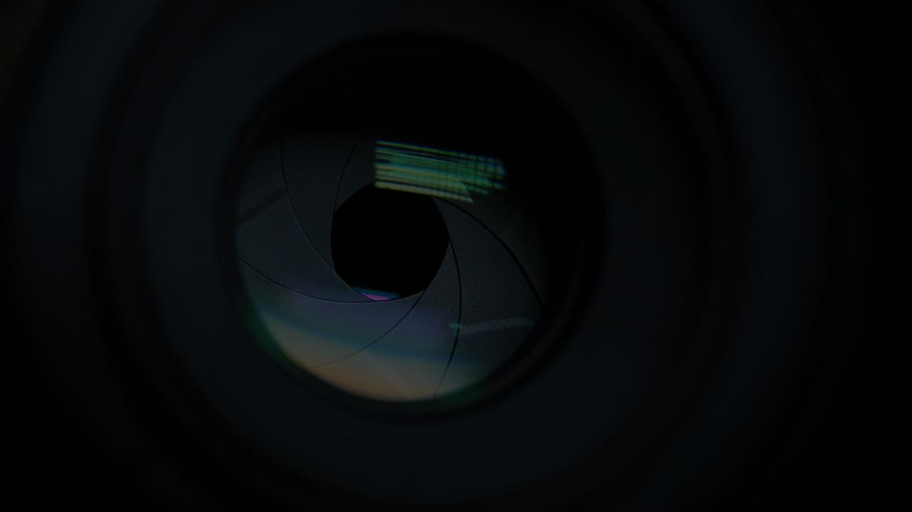  
  
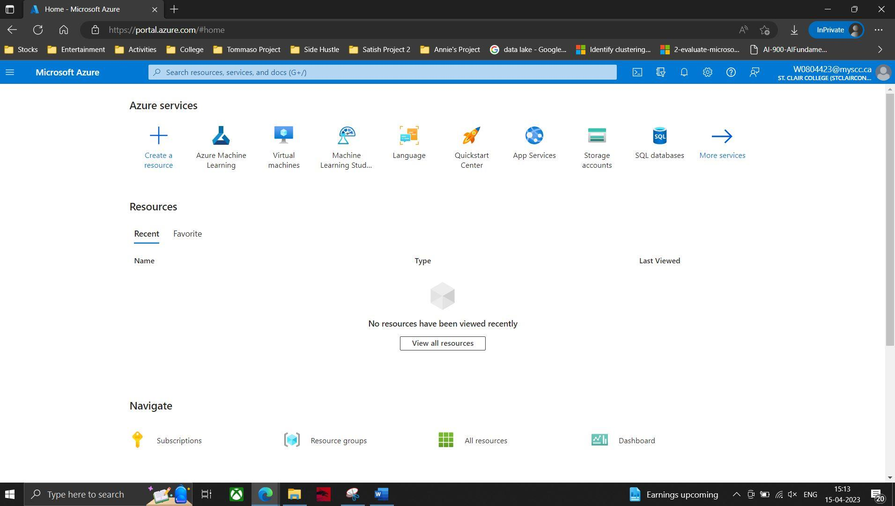  
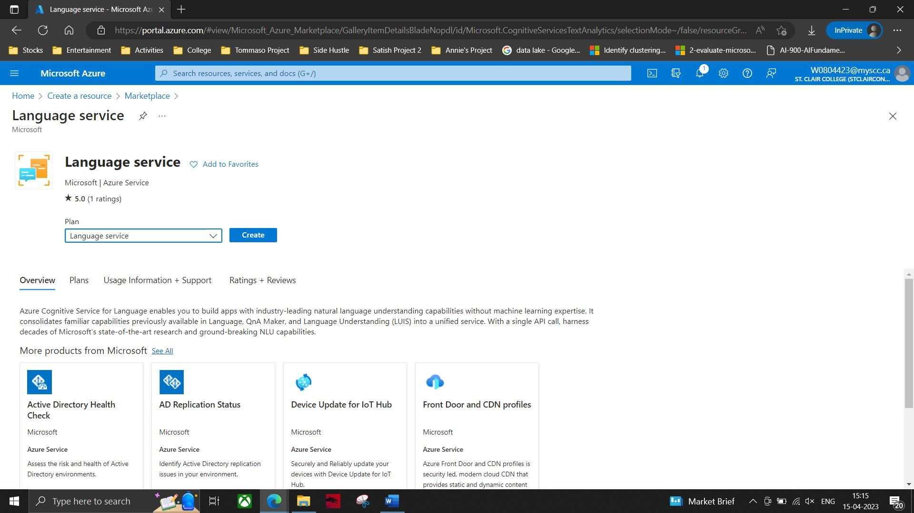  
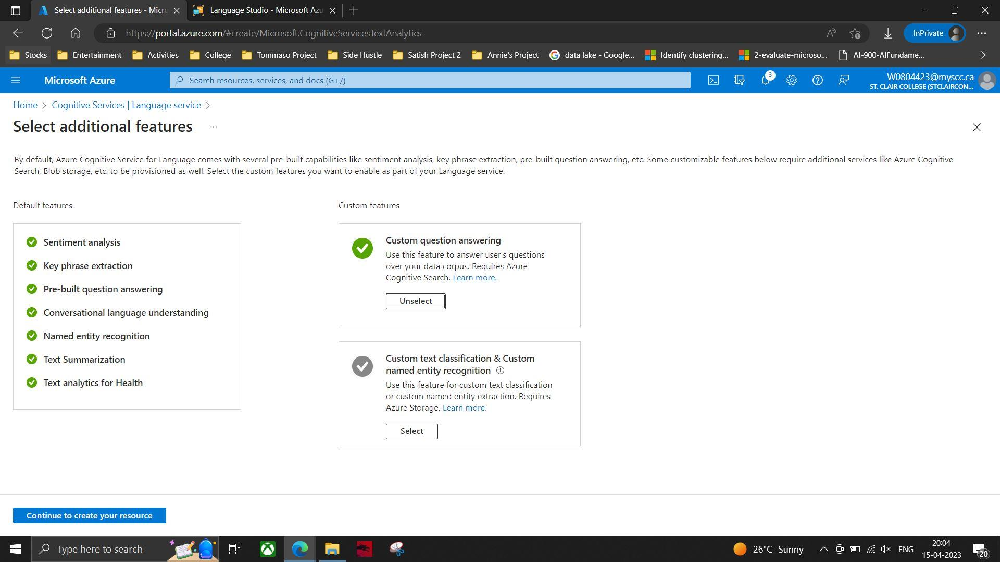  
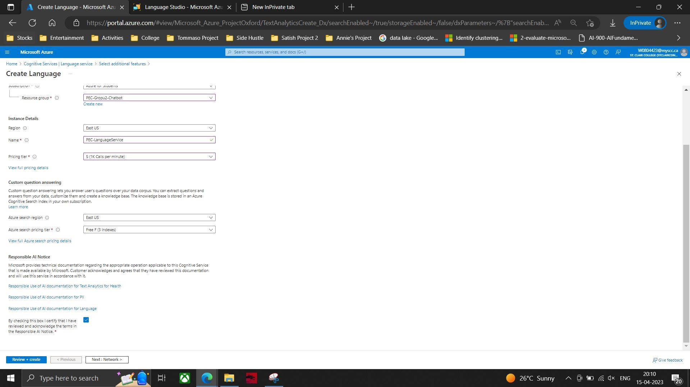  
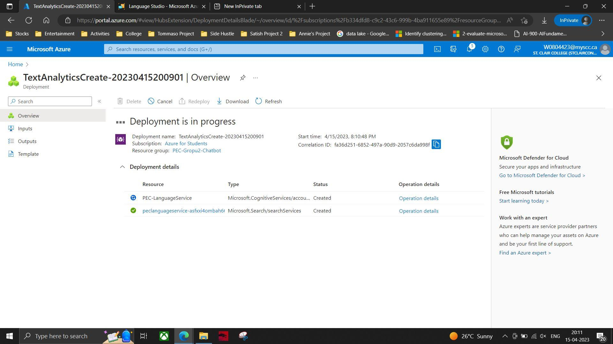  
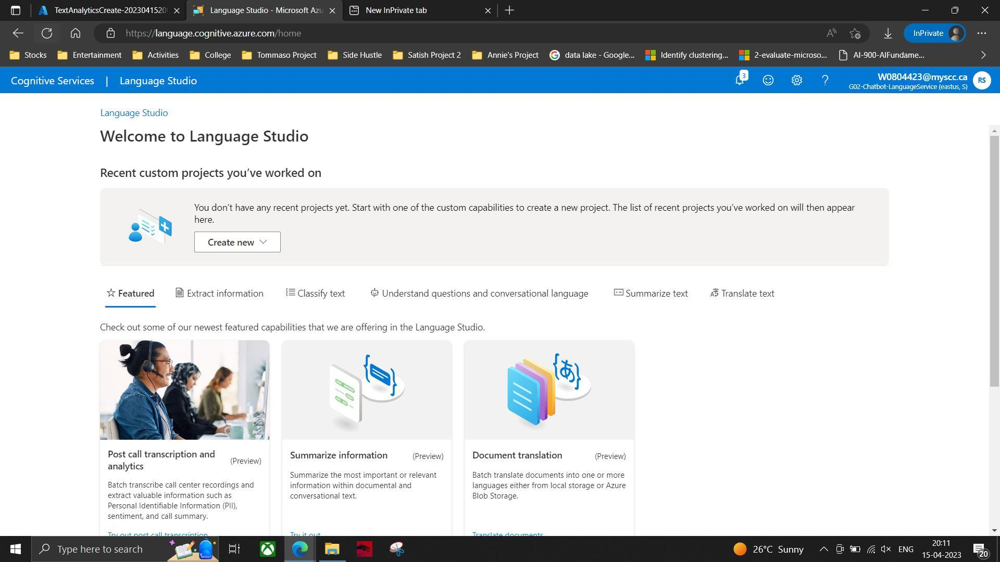  
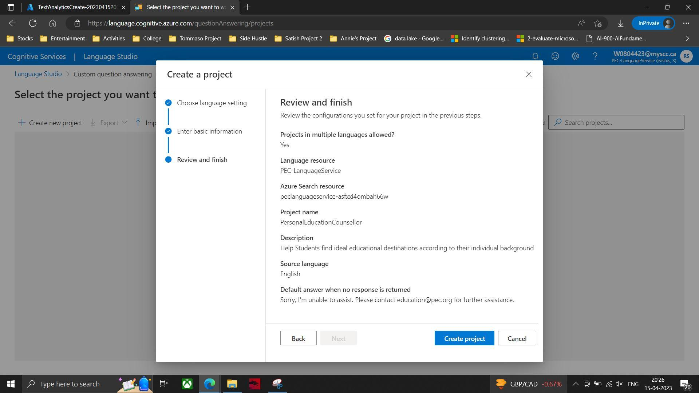  
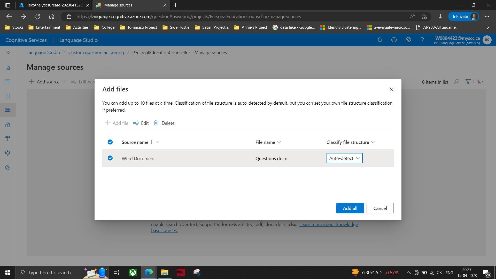  
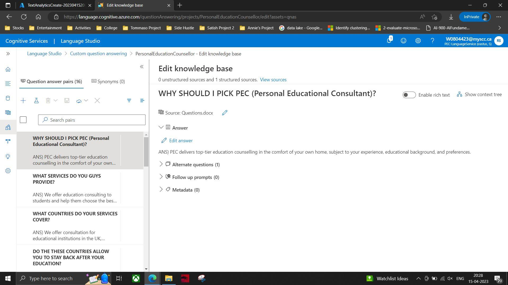  
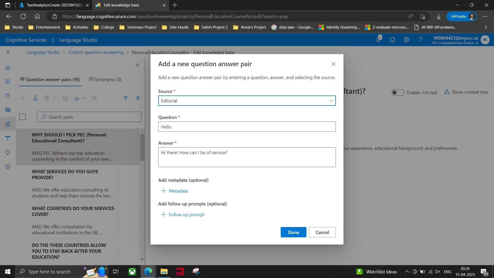  
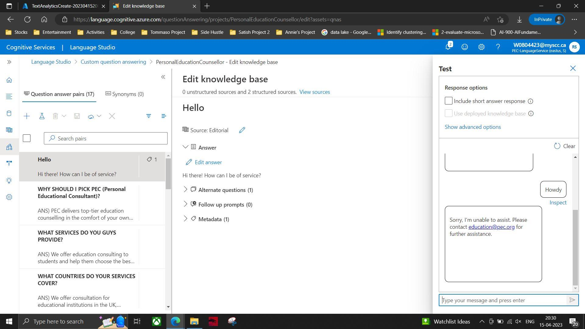  
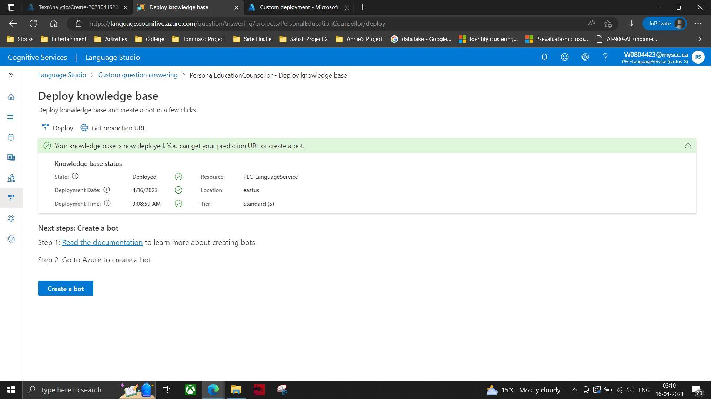  
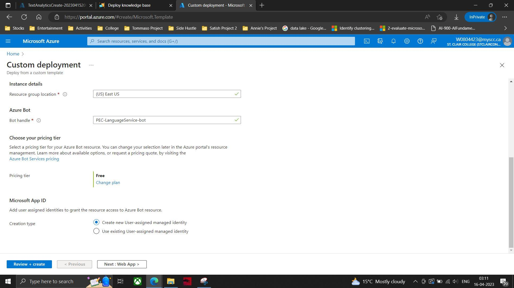  
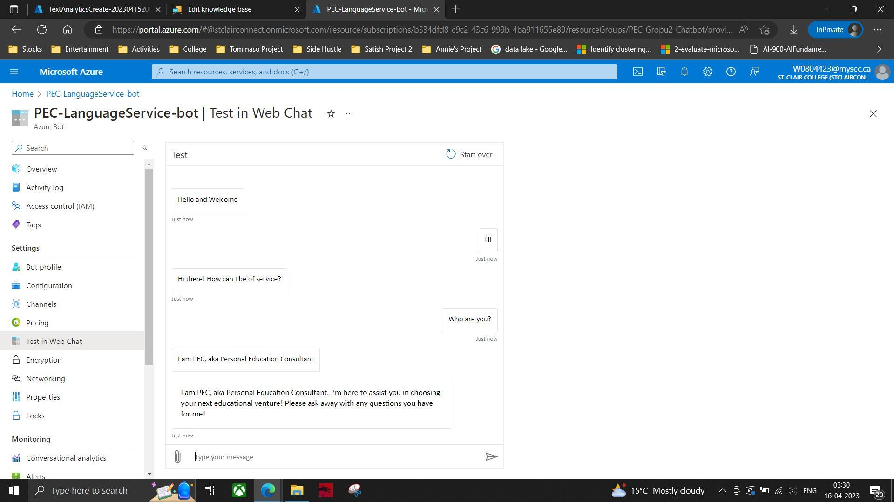  
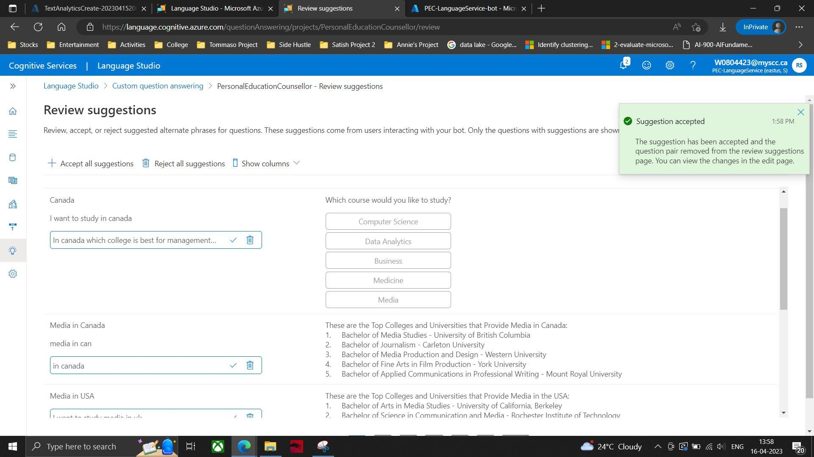  
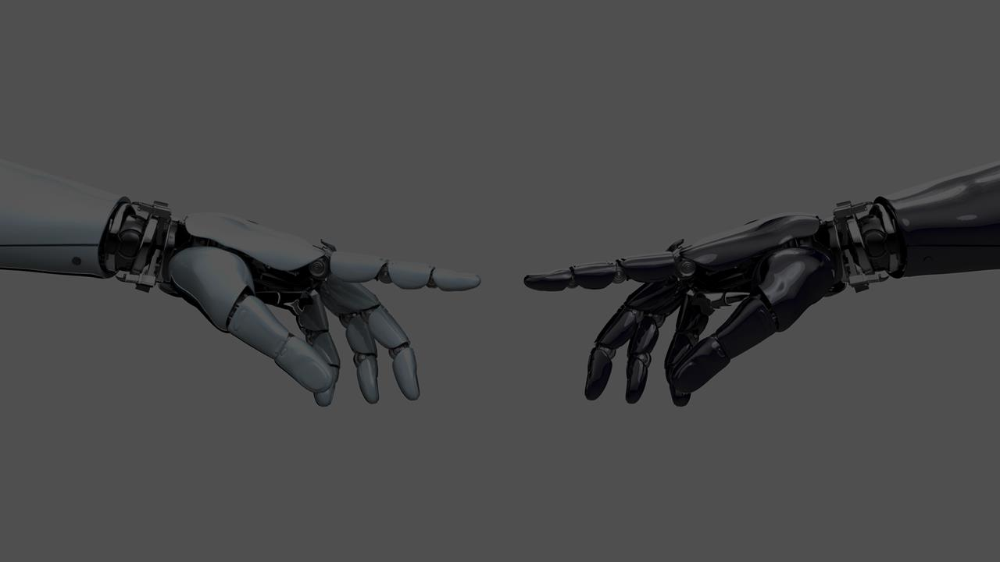  

*(Place your project screenshots inside a folder named `screenshots/` in your repo for these to render correctly.)*

---

## 🔮 Future Improvements

- Expand the question base for richer interaction  
- Enhance the knowledge pipeline for better accuracy  
- Cover broader student-related topics (scholarships, housing, career support)  

---

## 🛠️ Tech Stack

- **Microsoft Azure Language Studio**  
- **Azure QnA Maker**  
- **Web Deployment for Chatbot**
